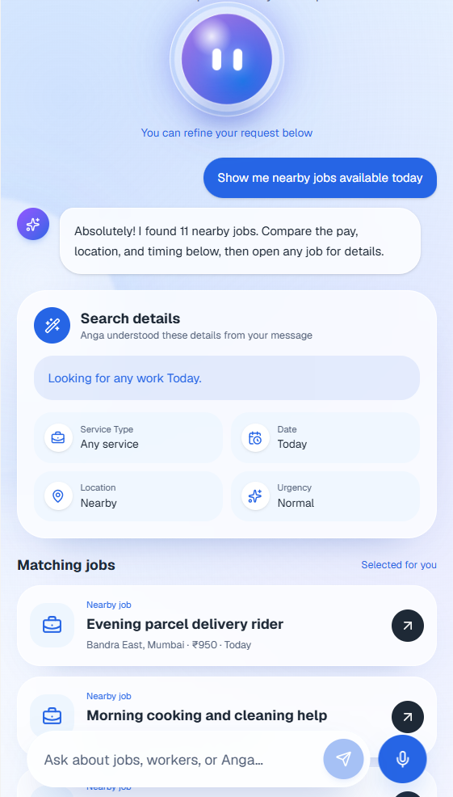

# Anga

### AI-powered local Rozgar for workers and customers

Anga is a mobile-first employment platform for daily-wage and local-service work. It helps workers discover nearby jobs with clear pay, timing, and location details, while helping customers find, compare, and hire trusted local workers.

The current project is a working full-stack MVP built for **Build for Good 2026** by **Team Waffles**. It includes an animated product website, an interactive phone demo, worker and customer applications, dual authentication flows, MongoDB-backed APIs, trust tools, and a relevance-aware AI Rozgar assistant.

<p align="center">
  
</p>

## Current Progress

| Area                | Status     | Current implementation                                                                                            |
| ------------------- | ---------- | ----------------------------------------------------------------------------------------------------------------- |
| Product website     | Ready      | Responsive landing page, GSAP/Lenis animations, mentor testimonial, FAQs, and product sections                    |
| Interactive demo    | Ready      | The real app runs inside a responsive phone mockup on a full-viewport cloud stage                                 |
| Authentication      | Working    | Email/password, mobile OTP, role selection, forgot-password entry point, and one-click demo accounts              |
| Worker experience   | Working    | Profile setup, nearby jobs, job details, applications, saved jobs, notifications, and availability                |
| Customer experience | Working    | Profile photo, job posting, service discovery, requests, applicants, saved workers, and assignment flows          |
| AI assistant        | Working    | Command-aware job/worker matching, ranked sources, contextual actions, and English/Hindi suggestions              |
| Backend             | Working    | Express APIs, MongoDB/Mongoose models, JWT sessions, OTP records, profiles, jobs, applications, and notifications |
| Android packaging   | Configured | Capacitor Android build and sync scripts are available                                                            |
| Production services | Planned    | Real SMS delivery, production maps/distance, payments, push notifications, and moderation                         |

## The Problem

Many local and daily-wage workers still depend on word of mouth, middlemen, and uncertain payment terms to find work. Customers face the opposite problem: finding someone nearby who is available, fairly priced, skilled, and trustworthy can take too long.

Anga brings both sides into one local-first workflow:

- nearby work instead of generic listings;
- clear wage, distance, date, timing, and urgency information;
- worker skills, experience, availability, ratings, photos, and trust signals;
- customer job posts with budgets, requirements, and problem photos;
- direct application, applicant review, assignment, and status tracking;
- AI guidance that responds to the user's actual command.

## Current Product Experience

### Interactive website and live demo

- Animated, responsive product website built around Anga's blue-and-white visual system.
- Full-screen cloud demo stage using the same visual treatment as the final landing CTA.
- Interactive application embedded inside a CSS-rendered phone mockup.
- Adaptive phone status bar that follows the app screen color.
- Product workspace preview, AI assistant imagery, and a testimonial from Suhas Vitthal Powar, Mentor — Build for Good 2026.
- Smooth GSAP and Lenis motion with reduced-motion support.

### Authentication

- Dedicated login and signup screens.
- Email and password registration/login.
- Mobile number and OTP authentication.
- Worker/customer role-aware routing.
- Demo Worker and Demo Customer buttons for judge-friendly access.
- Existing users return to the correct dashboard; incomplete profiles continue to setup.

### Worker journey

- Build a profile with name, area, skills, experience, expected wage, availability, work distance, photo, and optional document.
- Browse live nearby jobs with relevant seeded fallback data when the API is unavailable.
- Compare wage, distance, timing, location, customer rating, and verification signals.
- Open complete job details, view issue photos, apply, and track application status.
- Save jobs for later.
- Manage profile, notifications, language, payment preferences, and safety settings.

### Customer journey

- Build a customer profile with name, location, customer type, and profile photo.
- Browse services and nearby workers.
- Post a job with service, description, date, time, location, budget, urgency, worker count, and problem photo.
- Review requests and compare applicants by skill, rating, experience, distance, wage, availability, and verification.
- Open worker profiles, save workers, call, and assign.
- Manage notifications and preferences from the customer profile.

### AI Rozgar assistant

Anga includes a dedicated assistant at `/assistant` plus contextual assistant access from the app.

The assistant currently:

- recognizes job-search, worker-hiring, verification, safety, payment, greeting, and app-help intents;
- filters results by requested service, date, availability, and trust requirements;
- sorts requests such as closest, highest-paying, lowest-cost, or highest-rated;
- returns only relevant job, worker, request, help, or safety sources;
- provides direct actions to the appropriate Anga screen;
- avoids repeating unrelated cards when the user's command cannot be grounded;
- supports simple English and Hindi/Hinglish prompts.

Example prompts:

```text
Show me nearby electrician jobs available today
Which job pays the most?
Find a verified plumber available today
Mujhe aaj electrician ka kaam chahiye
How do I keep payment safe?
```

### Trust and safety

- Profile photos and worker documents.
- Verified and document-uploaded signals.
- Ratings, experience, completed-job context, and transparent wages.
- Report issue and SOS actions for accepted work.
- Payment, material-cost, and extra-charge guidance.
- Clear application and job status tracking.

## Demo Access

The fastest route is to open the landing page and choose **Try Live Demo**, then use **Demo Worker** or **Demo Customer** on the login screen.

For the local OTP flow:

```text
Mobile number: 1234567890
OTP: 1234
```

Recommended judge flow:

1. Open `/` and launch the live demo.
2. Continue through `/app` or go directly to login/signup.
3. Enter with a demo worker or customer account.
4. Explore the relevant dashboard and profile.
5. Try a nearby-job or worker request in `/assistant`.
6. Test job details/applications as a worker or job posting/applicants as a customer.

## Tech Stack

### Frontend

- React 19
- TanStack Start, TanStack Router, and TanStack Query
- Vite 8
- Tailwind CSS 4
- GSAP and ScrollTrigger
- Lenis smooth scrolling
- Lucide React
- Sonner notifications
- Capacitor Android

### Backend

- Node.js and Express 5
- MongoDB and Mongoose
- JWT authentication
- Password hashing with Node.js `crypto.scrypt`
- OTP records with expiration
- Role-protected profile, job, application, worker, and notification APIs

## Main Routes

### Website and entry

- `/` — product website and interactive live demo
- `/app` — splash and onboarding entry
- `/login` and `/signup` — compatibility redirects
- `/role-selection` — worker/customer selection

### Authentication

- `/auth/login`
- `/auth/signup`
- `/auth/phone`
- `/auth/otp`

### Worker

- `/worker`
- `/worker/setup`
- `/worker/job/$id`
- `/worker/applications`
- `/worker/saved`
- `/worker/notifications`
- `/worker/profile`

### Customer

- `/customer`
- `/customer/setup`
- `/customer/service/$slug`
- `/customer/request`
- `/customer/my-requests`
- `/customer/applicants/$id`
- `/customer/worker/$id`
- `/customer/saved`
- `/customer/notifications`
- `/customer/profile`

### Shared

- `/assistant`
- `/settings/preferences`

## Project Structure

```text
src/
  components/       Shared app shells, navigation, authentication, phone demo, and UI
  lib/              API client, session state, seed data, saved items, i18n, and RAG logic
  routes/           TanStack file routes for the website, auth, worker, customer, and assistant
server/
  config/           Database setup
  middleware/       JWT and role authorization
  models/           User, OTP, profiles, jobs, applications, and notifications
  routes/           Auth, profile, jobs, workers, applications, and notifications APIs
  seed.js           Development/demo data
public/demo/         Landing and product-demo assets
```

## Local Setup

### 1. Install dependencies

```bash
npm install
```

### 2. Configure the environment

Copy `.env.example` to `.env` and provide:

```env
MONGODB_URI=your_mongodb_connection_string
JWT_SECRET=your_jwt_secret
NODE_ENV=development
PORT=5000
VITE_API_URL=http://localhost:5000/api
VITE_GOOGLE_MAPS_API_KEY=optional_google_maps_key
```

### 3. Run the full application

```bash
npm run dev
```

This starts the Express API (default `http://localhost:5000`) and the Vite web application.

Useful individual commands:

```bash
npm run dev:web
npm run dev:api
npm run build
npm run lint
npm run preview
```

### 4. Build the Android project

```bash
npm run android:sync
```

This creates the mobile build and synchronizes it with the configured Capacitor Android project.

## API Areas

- **Auth:** credential registration/login, send OTP, verify OTP, current user, logout
- **Profiles:** worker and customer profile read/update, including photos and documents
- **Jobs:** create, browse, update, delete, nearby results, details, applicants, assignment, completion
- **Applications:** worker/customer application lists and status updates
- **Workers:** worker discovery and profile details
- **Notifications:** lists, read state, and bulk updates

## Current Limitations and Next Steps

The current build is a functional MVP and hackathon demo. Before production release, the project still needs:

- a real SMS provider and production OTP policy;
- production-grade password recovery and email verification;
- geospatial indexing and live travel-distance calculations;
- payment collection, tracking, and receipts;
- direct worker/customer messaging;
- push notifications;
- admin moderation, report handling, and document verification;
- cloud object storage for uploaded photos/documents;
- broader multilingual coverage and accessibility testing;
- automated unit, integration, and end-to-end test coverage.

## Verification

The current production build is verified with:

```bash
npm run build
```

The main landing, app, authentication, assistant, worker, and customer routes currently load successfully in the local preview.

---

Built by **Team Waffles** for **Build for Good 2026**.
